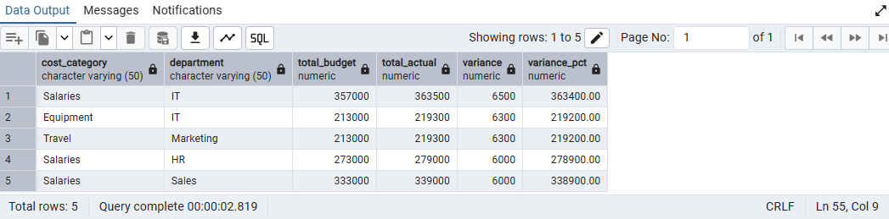
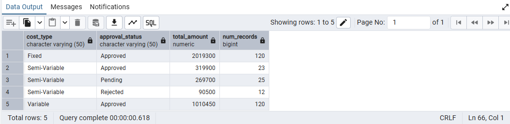
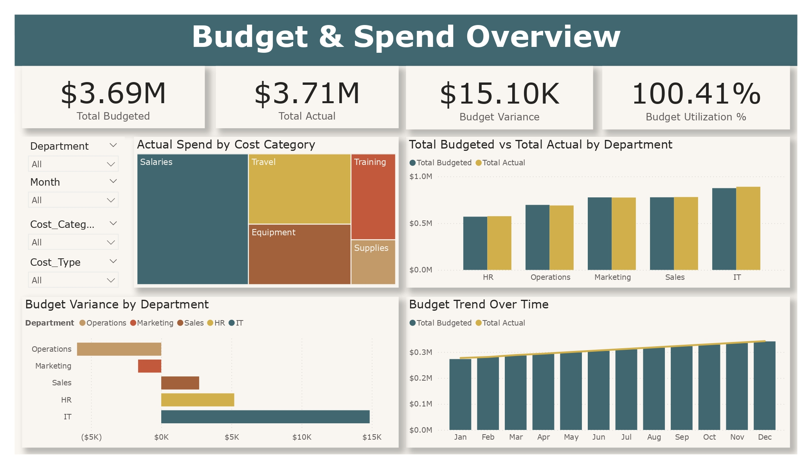
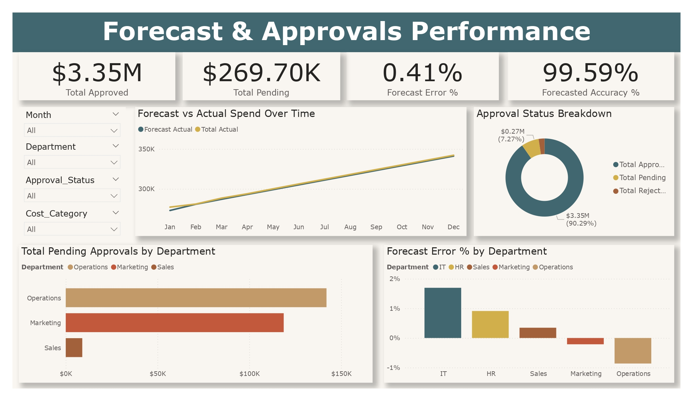

# Financial Expense Analysis & Budget Forecasting


# Table of contents

- [Project Overview](#project-overview)
  - [Executive Summary](#executive-summary)
  - [Business Problem](#business-problem)
  - [Project Objective](#project-objective)
  - [Key Metrics & KPIs](#keymetrics-&-kpi)
    - [Budget Overview](#budget-overview)
    - [Expense Segmentation](#expense-segmentation)
    - [Departmental Insights](#departmental-insights)
    - [Forecasting Opportunities](#forecasting-opportunities)
- [Tools & Workflow](#tools-&-workflow)
  - [Excel: Data Cleaning & Exploration](#excel:-data-cleaning-&-exploration)
  - [PostgreSQL: SQL Analysis](#postgresql:-sql-analysis)
  - [Power BI: Dashboard Development](#power-bi:-dashboard-development)
- [Data Collection](#data-collection)
  - [Source](#source)
  - [Structure & Format](#structure-&-format)
- [Data Preparation](#data-preparation)
  - [Data Types & Formatting](#data-types-&-formatting)
- [SQL Analysis](#sql-analysis)
  - [Business Questions Answered](#business-questioned-answered)
- [Data Modeling](#data-modeling)
  - [Star Schema Design](#star-schema-design)
  - [Table Relationships](#table-relationships)
- [DAX Calculations](#dax-calculations)
  - [Core Measures](#core-measures)
  - [Variance & Forecast Metrics](#variance-&-forecast-metrics)
- [Dashboard Design](#dashboard-design) 
  - [Visuals Used](#visuals-used)
  - [User Interaction & Features](#user-interaction-&-features)
- [Key Insights](#key-insights)
  - [Trends Identified](#trends-identified)
  - [Recommendations](#recommendations)

# Project Overview
## Executive Summary
This project focuses on analysing financial performance through expense and budget data to provide strategic insights into cost management, departmental efficiency, and forecasting accuracy. By leveraging Excel, PostgreSQL, and Power BI, I built a comprehensive reporting solution to help stakeholders track budget utilisation, identify spending trends, and forecast future expenses with greater confidence.

Through structured data modeling, advanced SQL queries, and interactive dashboards, this analysis offers visibility into how different departments manage their budgets, highlights variances between planned and actual spending, and uncovers opportunities for cost optimisation.
## Business Problem
The organisation lacked a centralised and interactive system for monitoring financial performance across departments. Budget tracking was manual and siloed, making it difficult to:
- Quickly compare actual vs. budgeted expenses
- Identify departments overspending or underutilising their budgets
- Evaluate forecast accuracy and respond proactively to variances
- Generate timely, data-driven insights for strategic financial planning

This lack of visibility limited effective decision-making and introduced financial risk due to late detection of anomalies and inefficiencies.
## Project Objective
The goal of this project was to develop a dynamic and insightful Financial Expense Analysis & Forecasting Dashboard to empower the organisation with:
- Real-time budget monitoring across all departments
- Accurate variance analysis between budgeted, actual, and forecasted expenses
- Improved financial forecasting to identify under- or over-utilisation early
- Segmented insights to spotlight departmental expense trends
- Enhanced decision-making through visual storytelling and KPI tracking

By leveraging Power BI, Excel, and PostgreSQL, the dashboard aims to unify expense data, highlight financial risks and opportunities, and guide strategic planning with clarity and speed.
## Key Metrics & KPIs
This project focused on identifying and tracking financial metrics that matter most to operational efficiency and strategic forecasting. The KPIs were grouped into four key analytical areas:
### Budget Overview
These KPIs assess overall budget planning and execution across the organisation:
- Total Budgeted: The planned amount allocated for spending.
- Total Actual: The actual amount spent.
- Budget Variance ($): The difference between budgeted and actual amounts.
- Budget Utilization (%): Percentage of budget spent, indicating over- or under-utilisation.
### Expense Segmentation
These KPIs break down financial activity by categories or departments:
- Total Pending: Amount yet to be approved or processed.
- Total Approaches: Sum of actuals and pending, signaling financial commitments.
- Departmental Spend Distribution: Comparative spending across departments or cost centers.
### Departmental Insights
These KPIs drill into specific organisational units to assess their financial behavior:
- Top Spending Departments
- Departments Exceeding Budget
- Underutilised Budget Areas
### Forecasting Opportunities
These KPIs measure financial forecasting performance and highlight trends:
- Forecast Error (%): Measures deviation between actual and forecasted expenses.
- Forecast Accuracy (%): Complements forecast error to show model reliability.
- Forecast vs Actual Trends: Visual timeline of forecast projections vs. outcomes.
## Tools & Workflow
This project followed a structured, tool-driven workflow to ensure efficiency, reproducibility, and insight-driven outcomes. Each tool played a critical role in the data analysis pipeline, from raw data handling to dashboard deployment.
### Excel: Data Cleaning & Exploration
Used for the initial exploration and pre-processing of raw financial data.
- Identified missing values, duplicates, and formatting inconsistencies
- Standardised column names and data types
- Conducted early profiling to spot budget anomalies and outliers
- Created summary tables for preliminary insights
### PostgreSQL: SQL Analysis
Served as the main analytical engine for slicing data, answering business questions, and preparing for modeling.
- Imported cleaned Excel data into PostgreSQL database
- Joined and transformed tables using SQL
- Calculated core aggregates, like budget utilisation and spend variances
- Wrote analytical queries to support Power BI visuals
### Power BI: Dashboard Development
Used for building an interactive and visually engaging dashboard to present results to stakeholders.
- Modeled data using a star schema
- Built DAX measures for KPIs (e.g., Forecast Accuracy %, Budget Variance)
- Designed dashboard pages grouped by business function (budget, forecast)
- Added slicers, filters, and bookmarks for interactivity
## Data Collection
The foundation of this analysis was built on a single, rich dataset provided in Excel format. It contained detailed financial performance data across multiple departments, categories, and time periods.
### Source
- File Name: Financial_Expenses_Raw_Data.xlsx
- Provided By: Internal finance team (hypothetical)
- Scope: Captures monthly and quarterly budget data with cost category breakdowns, actual spend, and approval statuses.
### Structure & Format
The dataset was structured in a flat format, where each row represented a unique budget entry linked to a specific department, cost type, and time period.
| Column Name | Description |
| --- | --- |
| Month | Reporting month (e.g., January, February) |
| Quarter | Fiscal quarter (e.g., Q1, Q2) |
| Department | 	Department responsible for the budget line (e.g., IT, HR, Marketing, Operations, Sales) |
| Cost Category | Expense category (e.g., Travel, Salaries, Equipment, Supplies, Training) |
| Cost Type | Nature of expense (e.g., Fixed, Semi-Variable, Variable) |
| Project Code | Identifier for specific project or initiative |
| Budgeted Amount | Planned/allocated financial amount |
| Actual Amount | Actual amount spent for the entry |
| Approval Status | Whether the expense was approved, pending, or rejected |
| Comments | Additional notes or justifications for the entry |
## Data Preparation
To ensure high data quality and reliable insights, the raw dataset underwent a comprehensive preparation process in Excel and PostgreSQL.
### Initial Cleaning (Excel)
- Removed duplicate rows to eliminate redundancy.
- Standardised column names (e.g., lowercase, underscores instead of spaces).
- Cleaned column values for consistency — especially in Department, Cost Category, and Approval Status (e.g., fixed typos, consistent casing).
### Data Type Formatting
- Converted Month and Quarter columns to categorical values.
- Formatted Budgeted Amount and Actual Amount as numeric (float).
- Parsed Project Code as text to retain leading zeros if any.
### Derived Columns
To enhance analysis and modeling:
| New Column | Logic |
| --- | ---|
| Variance | Budgeted Amount - Actual Amount |
| Variance % | ((Budgeted - Actual) / Budgeted) * 100 (handled div-by-zero) |
## SQL Analysis
Structured querying in PostgreSQL helped transform raw data into actionable insights by addressing key business questions around budget utilisation, cost segmentation, and forecasting.
- What are the top 5 categories or departments consistently over budget?
``` sql

SELECT 
	cost_category, 
	department, 
	SUM(budgeted_amount) AS total_budget, 
	SUM(actual_amount) AS total_actual, 
	SUM(actual_amount) - SUM(budgeted_amount) AS variance,
	ROUND(SUM(actual_amount) - SUM(budgeted_amount) / NULLIF(SUM(budgeted_amount), 0) * 100.0, 2) AS variance_pct
FROM finance
GROUP BY cost_category, department
ORDER BY variance DESC
LIMIT 5;

```


- How does spending trend across quarters for each department?
``` sql

SELECT quarter, department, SUM(actual_amount) AS total_spend
FROM finance
GROUP BY quarter, department
ORDER BY quarter, department;

```


- What is the total approved vs unapproved amount per cost type?
``` sql

SELECT 
	cost_type, 
	approval_status,
	SUM(actual_amount) AS total_amount,
	COUNT(*) AS num_records
FROM finance
GROUP BY cost_type, approval_status
ORDER BY cost_type, approval_status;

```


- How much does each cost type contribute to total expenses?
``` sql

SELECT 
	cost_type, 
	COUNT(*) AS num_records,
	SUM(actual_amount) AS total_expenses,
	ROUND(SUM(actual_amount) / 
	(
		SELECT SUM(actual_amount) 
		FROM finance
	) * 100.0, 2)  AS percent_of_total
FROM finance
GROUP BY cost_type
ORDER BY total_expenses DESC;

```


- Which projects are driving most of the over-budget spend?
``` sql

SELECT 
	project_code, 
	department,
	SUM(budgeted_amount) AS total_budget,
	SUM(actual_amount) AS total_actual,
	SUM(actual_amount) - SUM(budgeted_amount) AS overage,
	ROUND(SUM(actual_amount) - SUM(budgeted_amount) / NULLIF(SUM(actual_amount), 0), 2) AS overage_pct
FROM finance
GROUP BY project_code, department
HAVING SUM(actual_amount) > SUM(budgeted_amount)
ORDER BY overage DESC
LIMIT 5;

```


## Data Modeling
To enable efficient analysis and dashboard performance, a star schema was designed to organise the dataset into fact and dimension tables. This approach ensured scalable data integration and streamlined DAX calculations in Power BI.
### Star Schema Design
The model follows a star schema layout with a central fact table and supporting dimension tables:

#### Fact Table
- Fact_Expenses
  - Contains all measurable values such as:
    - Budgeted Amount
    - Actual Amount
    - Approval Status
    - Cost Category
#### Dimensions Table
- Dim_Department — maps department names for drilldown
- Dim_Date — captures month, quarter, and year values
- Dim_Cost_Type — categorizes costs as Fixed, Variable, or Semi-Variable
- Dim_Approval — supports status-level filtering (Approved, Rejected, Pending)—
This structure supports slicing and filtering across departments, time periods, projects and expense types.
### Table Relationship
The tables were related in a one-to-many structure:
- Dim_Department[Department] → Fact_Expenses[Department]
- Dim_Date[Month] → Fact_Expenses[Month]
- Dim_Cost_Type[Cost Type] → Fact_Expenses[Cost Type]
- Dim_Approval[Approval Status] → Fact_Expenses[Approval Status]

This layout allowed for efficient filtering and slicing across the dashboard, enabling multi-dimensional analysis (e.g., budget trends over time per department and cost type).

## DAX Calculations
To drive insights and enable KPI tracking, a set of calculated measures were developed using DAX (Data Analysis Expressions). These measures were grouped logically into categories to align with the business objectives and dashboard layout.
### Core Measures
- Total Budgeted Amount = SUM(Fact_Expenses[Budgeted Amount])
- Total Actual Amount = SUM(Fact_Expenses[Actual Amount])
- Total Approved = CALCULATE([Total Actual], Dim_Approval[Approval Status] = "Approved")
- Total Pending = CALCULATE([Total Actual], Dim_Approval[Approval Status] = "Pending")
- Total Rejected = CALCULATE([Total Actual], Dim_Approval[Approval Status] = "Rejected")
### Variance & Forecast Metrics
- Budget Variance = [Total Actual] - [Total Budgeted]
- Budget Variance % = DIVIDE([Budget Variance], [Total Budgeted], 0)
- Budget Utilization % = DIVIDE([Total Actual], [Total Budgeted], 0)
- Forecast Actual = [Total Budgeted]
- Forecast Error % = DIVIDE([Total Actual] - [Forecast Actual], [Forecast Actual])
- Forecasted Accuracy % = 1 - ABS([forecast Error %])
## Dashboard Design
### Visuals Used
#### Page 1: Budget & Spend Overview
##### Objective: Understand how departments are managing their budgets, actuals, and approvals.
- KPI Cards (Top Row):
  - Total Budget
  - Total Actual
  - Budget Variance
  - Budget Utilization %
- Clustered Column Chart – Budget vs Actual by Department
- Line & Column Chart – Budget Trend Over Time
- Bar Chart – Budget Variance by Department
- Tree Map – Actual Spend by Cost Category
#### Page 2: Forecast & Approvals Performance
##### Objective: Evaluate forecast accuracy and track approval statuses.
- KPI Cards (Top Row)
  - Forecast Accuracy %
  - Forecast Error %
  - Total Approved
  - Total Pending
- Line Chart – Forecast vs Actual Spend Over Time
- Donut Chart – Approval Status Breakdown
- Stacked Bar Chart – Pending Approvals by Department
- Bar Chart – Forecast Error by Department
### User Interaction & Features
Both pages include interactive features designed to help users filter, focus, and drill into insights:
- Slicers (Page 1 Sidebar):
  - Department
  - Month
  - Cost Category
  - Cost Type
- Slicers (Page 2 Sidebar):
  - Month
  - Department
  - Approval Status
  - Cost Category
- Tooltip Enhancements:
  - KPI and trend visuals include tooltips explaining calculation logic (e.g., how forecast accuracy is computed).
- Cross-Filtering Enabled:
  - Clicking on one visual dynamically filters others to allow multi-angle exploration.





## Key Insights
### Trends Identified
- Budget Management Varies by Department:
Some departments consistently overspent or underspent. For instance, [insert example: “Marketing showed a consistent overspend trend in Q2 and Q3”], while others remained on target.
- High Budget Utilization Rates:
Overall budget utilization remained above 90%, indicating strong alignment with allocated budgets, but also signaling minimal flexibility for unforeseen expenses.
- Cost Type Distribution is Uneven:
Variable costs formed a large portion of actual spending, suggesting high dependence on scalable or project-based expenses.
- Forecast Accuracy was High:
The forecast accuracy rate reached 99.59%, indicating excellent predictability in spending patterns.
- Approval Bottlenecks in Certain Departments:
Departments like [insert example: “Operations”] had higher-than-average pending or rejected approvals, potentially affecting timely execution.
### Recommendations
- Implement Monthly Budget Reviews:
To manage departments with fluctuating spend more proactively, set up monthly review checkpoints.
- Investigate High Variable Costs:
A deeper analysis of variable cost contributors may help identify cost-saving opportunities or renegotiation of supplier contracts.
- Targeted Training for Budget Overspenders:
Equip departments with better forecasting tools or training, especially those frequently exceeding budget.
- Streamline the Approval Process:
Consider automating or revising the approval flow for faster processing and better spend governance.
- Forecasting Model Deployment:
Operationalize the current forecasting logic to continuously monitor forecast errors and pre-empt deviations before they occur.


 


